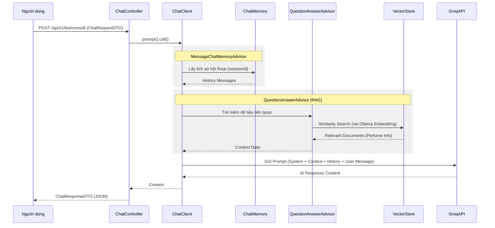

# Luồng tư vấn Chatbot AI (AI Consultation Flow)

## Sơ đồ Sequence

## Các thành phần chính và Liên kết Code
| Thành phần | Class thực tế | Mô tả |
| :--- | :--- | :--- |
| API Endpoint | [`ChatController.java`](../../src/main/java/com/example/perfume_store/modules/assistant/controller/ChatController.java) | Xử lý request từ client và điều phối ChatClient |
| Cấu hình Bộ nhớ | [`AiConfig.java`](../../src/main/java/com/example/perfume_store/configs/ai/AiConfig.java) | Định nghĩa bean ChatMemory cho hội thoại |
| Dữ liệu đầu vào | [`ChatRequestDTO.java`](../../src/main/java/com/example/perfume_store/modules/assistant/dto/request/ChatRequestDTO.java) | Chứa tin nhắn và sessionId |
| Dữ liệu đầu ra | [`ChatResponseDTO.java`](../../src/main/java/com/example/perfume_store/modules/assistant/dto/response/ChatResponseDTO.java) | Chứa câu trả lời của AI |

## Chi tiết logic
1. **Khởi tạo**: `ChatController` được cấu hình với `QuestionAnswerAdvisor` (để lấy thông tin từ Qdrant) và `MessageChatMemoryAdvisor` (để nhớ lịch sử).
2. **Tham số tìm kiếm**: Sử dụng `topK(5)` và `similarityThreshold(0.7)` (mặc định) để lọc các sản phẩm phù hợp nhất.
3. **Xử lý Request**: Nhận `message` và `sessionId`. Nếu không có `sessionId`, hệ thống tự tạo mới.
4. **Tìm kiếm (Retrieval)**: Spring AI tự động gọi **Ollama (mxbai-embed-large)** để chuyển `message` thành vector, sau đó thực hiện tìm kiếm tương đồng trên Qdrant.
5. **Tạo phản hồi (Generation)**: Tổng hợp thông tin sản phẩm tìm được + lịch sử hội thoại + System Prompt để gửi cho Llama 3.3 (via Groq) xử lý và trả về câu trả lời cuối cùng.
