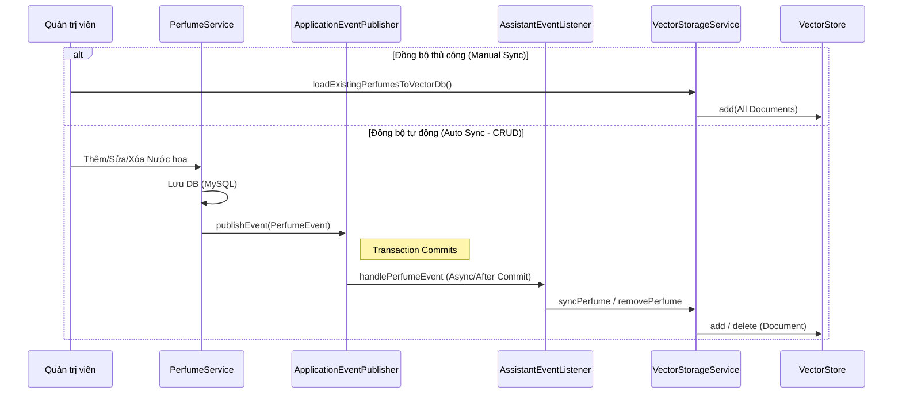

# Luồng đồng bộ dữ liệu Vector (Vector Data Sync Flow)

## Sơ đồ Sequence

## Các thành phần chính và Liên kết Code
| Thành phần | Class thực tế | Mô tả |
| :--- | :--- | :--- |
| Nguồn dữ liệu | [`PerfumeService.java`](../../src/main/java/com/example/perfume_store/modules/perfume/service/PerfumeService.java) | Phát sự kiện khi dữ liệu thay đổi |
| Đối tượng sự kiện | [`PerfumeEvent.java`](../../src/main/java/com/example/perfume_store/modules/perfume/event/PerfumeEvent.java) | Chứa thông tin thay đổi (id, operation) |
| Lắng nghe sự kiện | [`AssistantEventListener.java`](../../src/main/java/com/example/perfume_store/modules/assistant/service/AssistantEventListener.java) | Tiếp nhận sự kiện sau khi DB commit |
| Xử lý Vector | [`VectorStorageService.java`](../../src/main/java/com/example/perfume_store/modules/assistant/service/VectorStorageService.java) | Chuyển đổi Entity sang Document và gửi lên Qdrant |

## Chi tiết logic
1. **Event Emission**: Trong các hàm `create`, `update`, `delete` của `PerfumeService`, một `PerfumeEvent` được tạo ra.
2. **Transactional Integrity**: `AssistantEventListener` sử dụng `@TransactionalEventListener(phase = TransactionPhase.AFTER_COMMIT)`. Điều này đảm bảo dữ liệu chỉ được gửi lên Qdrant khi và chỉ khi dữ liệu trong MySQL đã được lưu thành công.
3. **Idempotency**: Sử dụng `perfume_id` làm ID cho `Document` trong VectorStore, giúp việc cập nhật hoặc xóa bản ghi diễn ra chính xác mà không bị trùng lặp.
