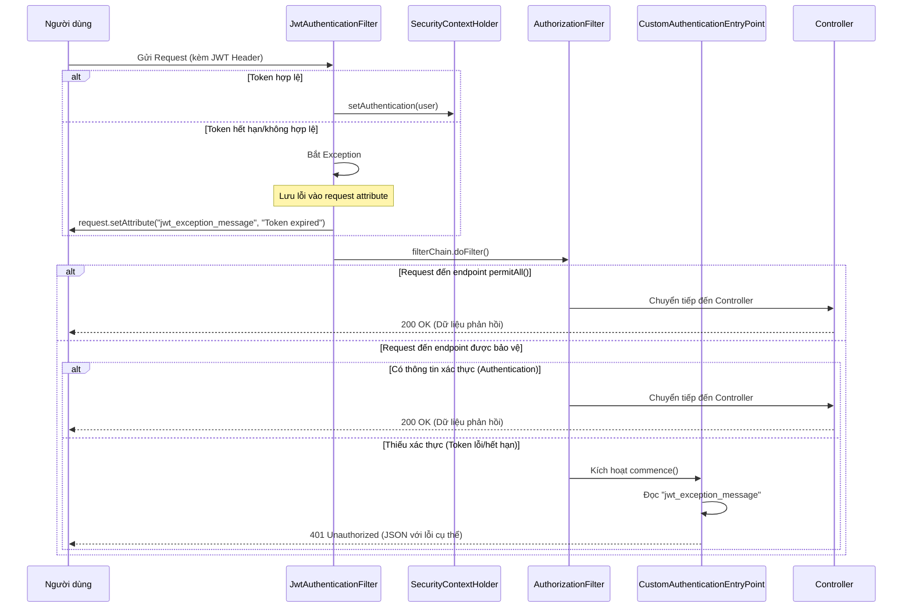

# Luồng Xác Thực JWT & Kiểm Tra Token

Tài liệu này mô tả cách hệ thống xử lý việc kiểm tra token JWT, cho phép truy cập công khai vào các endpoint cụ thể trong khi vẫn cung cấp thông báo lỗi chi tiết (như "Token expired") cho các tài nguyên được bảo vệ.

## Sơ đồ Sequence

## Các thành phần chính và Liên kết Code

| Thành phần | Class thực tế | Mô tả |
| :--- | :--- | :--- |
| **JWT Filter** | [`JwtAuthenticationFilter.java`](../../src/main/java/com/example/perfume_store/modules/auth/security/jwt/JwtAuthenticationFilter.java) | Trích xuất và kiểm tra sơ bộ token. Lưu lỗi vào attribute nếu token hỏng/hết hạn. |
| **Security Config** | [`SecurityConfig.java`](../../src/main/java/com/example/perfume_store/configs/security/SecurityConfig.java) | Cấu hình các quy tắc `permitAll()` và đăng ký filter. |
| **Entry Point** | [`AuthenticationEntryPoint`](../../src/main/java/com/example/perfume_store/configs/security/SecurityConfig.java#L125) | Được định nghĩa bean bên trong `SecurityConfig.java` để xử lý trả về lỗi JSON. |
| **JWT Service** | [`JwtService.java`](../../src/main/java/com/example/perfume_store/modules/auth/security/jwt/JwtService.java) | Logic giải mã và kiểm tra tính hợp lệ của token. |

---

### Chi tiết logic:

1.  **JwtAuthenticationFilter**:
    - Trích xuất token từ header `Authorization`.
    - Gọi `JwtService` để kiểm tra.
    - **Quyết định quan trọng:** Nếu kiểm tra thất bại, filter **không** dừng request. Nó chỉ lưu lỗi vào `request.setAttribute("jwt_exception_message", ...)` và gọi `filterChain.doFilter()`. Điều này đảm bảo các endpoint công khai vẫn có thể truy cập được.

2.  **Spring Security Authorization**:
    - Sau khi qua filter, Spring Security sẽ kiểm tra `SecurityContextHolder`.
    - Đối với các route `permitAll()`, nó cho phép request đi qua bất kể có authentication hay không.
    - Đối với các route được bảo vệ, nếu không thấy authentication, nó sẽ gọi đến `AuthenticationEntryPoint`.

3.  **Custom AuthenticationEntryPoint**:
    - Đây là "chốt chặn cuối" cho các tài nguyên bảo mật.
    - Nó kiểm tra `request.getAttribute("jwt_exception_message")`.
    - Nếu có giá trị, nó sẽ trả về mã lỗi 401 kèm message đó để Frontend có thể xử lý (ví dụ: thông báo token hết hạn).
    - Nếu không có, nó trả về thông báo mặc định yêu cầu đăng nhập.
