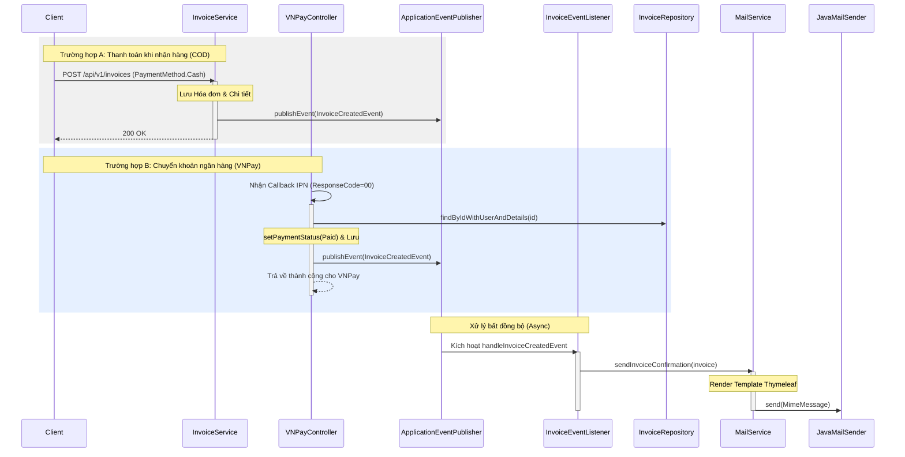

# Luồng Gửi Email Thông Báo Hóa Đơn

Tài liệu này mô tả hệ thống hướng sự kiện (event-driven) được sử dụng để gửi email xác nhận đơn hàng cho khách hàng. Hệ thống xử lý các thời điểm gửi khác nhau dựa trên phương thức thanh toán và đảm bảo tính nhất quán của dữ liệu trên các luồng xử lý bất đồng bộ.

## Sơ đồ Sequence



## Các thành phần chính và Liên kết Code

| Thành phần | Class thực tế | Mô tả |
| :--- | :--- | :--- |
| Nguồn phát sự kiện | [`InvoiceService.java`](../../src/main/java/com/example/perfume_store/modules/invoice/service/InvoiceService.java) | Kích hoạt gửi email cho đơn hàng COD ngay sau khi tạo. |
| Callback thanh toán | [`VNPayController.java`](../../src/main/java/com/example/perfume_store/modules/payment/controller/VNPayController.java) | Kích hoạt gửi email cho đơn hàng chuyển khoản sau khi xác nhận IPN thành công. |
| Truy xuất dữ liệu | [`InvoiceRepository.java`](../../src/main/java/com/example/perfume_store/domain/invoice/InvoiceRepository.java) | Sử dụng Eager Fetching để cung cấp dữ liệu đầy đủ cho luồng gửi mail bất đồng bộ. |
| Đối tượng sự kiện | [`InvoiceCreatedEvent.java`](../../src/main/java/com/example/perfume_store/modules/invoice/event/InvoiceCreatedEvent.java) | Mang thông tin thực thể Invoice đi xuyên suốt hệ thống sự kiện. |
| Lắng nghe sự kiện | [`InvoiceEventListener.java`](../../src/main/java/com/example/perfume_store/modules/invoice/event/InvoiceEventListener.java) | Lắng nghe sự kiện và thực thi logic gửi email **bất đồng bộ** (`@Async`). |
| Logic Email | [`MailService.java`](../../src/main/java/com/example/perfume_store/modules/invoice/service/MailService.java) | Xử lý việc render template (Thymeleaf) và tương tác với SMTP. |
| Template Email | [`invoice-confirmation.html`](../../src/main/resources/templates/mail/invoice-confirmation.html) | Template HTML responsive sử dụng inline CSS để tương thích với các trình đọc mail. |

---

## Chi tiết logic xử lý

1.  **Tách biệt bằng Event-Driven:** Hệ thống không gửi email trực tiếp từ `InvoiceService`. Thay vào đó, nó phát ra một `InvoiceCreatedEvent`. Điều này giúp quá trình thanh toán diễn ra nhanh chóng và tách biệt logic nghiệp vụ khỏi logic thông báo.
2.  **Thời điểm gửi có điều kiện:**
    *   **COD:** Vì không có bước thanh toán tức thì, email được gửi ngay khi đơn hàng được đặt.
    *   **Chuyển khoản (VNPay):** Để tránh gửi xác nhận cho các đơn hàng chưa thanh toán hoặc bị hủy, sự kiện chỉ được phát ra khi hệ thống nhận được tín hiệu "Thành công" hợp lệ từ cổng thanh toán.
3.  **Thực thi bất đồng bộ:** `InvoiceEventListener` được đánh dấu bằng `@Async`. Điều này đảm bảo rằng nếu máy chủ SMTP chậm hoặc gặp lỗi, nó sẽ không làm nghẽn luồng chính của ứng dụng hoặc làm chậm phản hồi cho phía VNPay.

---

## ⚠️ Ghi chú Kiến trúc: Lazy Loading & Ngữ cảnh Async

### Phân tích nguyên nhân gốc rễ (Root Cause)
Trong quá trình phát triển, một lỗi nghiêm trọng đã được xác định khi email không được gửi đi trong callback IPN của VNPay, mặc dù cơ sở dữ liệu đã được cập nhật chính xác.

**Vấn đề:**
1.  **Lazy Proxies:** Theo mặc định, JPA/Hibernate tải các thực thể liên quan (như `User` và `InvoiceDetails`) bằng cơ chế **Lazy Loading**. Khi logic IPN truy vấn một `Invoice`, các trường này chỉ là các "Proxy" (vỏ rỗng).
2.  **Ranh giới luồng (Thread Boundaries):** Email được gửi trong một **luồng riêng biệt** do sử dụng `@Async`.
3.  **Mất Session:** Ngay sau khi luồng IPN hoàn thành giao dịch cơ sở dữ liệu, Hibernate Session sẽ bị đóng. Khi Luồng gửi mail bất đồng bộ cố gắng truy cập `invoice.getUser().getEmail()` để gửi mail, nó gặp lỗi `LazyInitializationException` vì session đã mất và dữ liệu chưa được tải. Lỗi này thường xảy ra âm thầm trong các luồng chạy ngầm.

### Giải pháp: Eager Fetching
Để khắc phục điều này, chúng ta đã triển khai một truy vấn chuyên biệt trong `InvoiceRepository`:

```java
@Query("SELECT i FROM Invoice i JOIN FETCH i.user JOIN FETCH i.invoiceDetails WHERE i.id = :id")
Optional<Invoice> findByIdWithUserAndDetails(@Param("id") Integer id);
```

**Tại sao giải pháp này hiệu quả:**
*   Từ khóa `JOIN FETCH` buộc Hibernate phải tải `User` và tất cả `InvoiceDetails` trong **một câu lệnh SQL duy nhất**.
*   Khi đối tượng `Invoice` được chuyển sang luồng bất đồng bộ (Async thread), nó đã "Đầy đủ" (Dữ liệu thật, không phải proxy). Nó không còn cần một session cơ sở dữ liệu đang hoạt động để truy cập các thuộc tính của mình.

### Ví dụ thực tế
**Kịch bản:** Một khách hàng thanh toán 2.500.000 VNĐ qua VNPay.
1.  VNPay gửi IPN đến `VNPayController`.
2.  Controller gọi `repository.findByIdWithUserAndDetails(id)`.
3.  SQL được sinh ra: `SELECT ... FROM invoice JOIN user ... JOIN invoice_details ...`.
4.  Controller cập nhật trạng thái thành `PAID` và phát sự kiện với đối tượng Invoice đã **tải đầy đủ dữ liệu**.
5.  `MailService` nhận đối tượng trong luồng mới, đọc thông tin `invoice.getUser().getEmail()` và danh sách sản phẩm mà không gặp bất kỳ lỗi nào, sau đó gửi email thành công.
