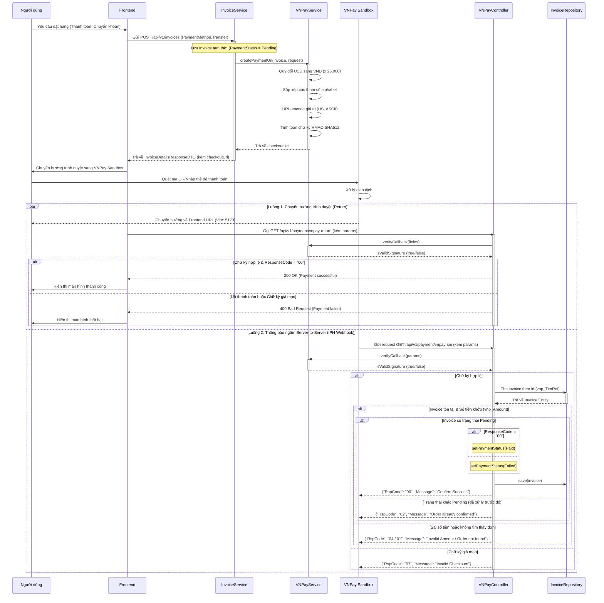

# Luồng Thanh Toán Qua VNPay

Tài liệu này mô tả chi tiết quy trình xử lý thanh toán trực tuyến tích hợp với cổng thanh toán VNPay, bao gồm luồng sinh liên kết thanh toán từ hóa đơn, xử lý redirect phía client (Return URL) và cơ chế cập nhật trạng thái đơn hàng bất đồng bộ giữa các máy chủ (IPN Webhook).

## Sơ đồ Sequence

## Các thành phần chính và Liên kết Code

| Thành phần | Class thực tế | Mô tả |
| :--- | :--- | :--- |
| **Cấu hình VNPay** | [`VNPayConfig.java`](../../src/main/java/com/example/perfume_store/configs/payment/VNPayConfig.java) | Đọc thông tin từ tệp môi trường `.env` (`tmn-code`, `hash-secret`, `pay-url`, `return-url`). |
| **Công cụ mã hóa** | [`VNPayUtil.java`](../../src/main/java/com/example/perfume_store/configs/payment/VNPayUtil.java) | Thực hiện mã hóa chữ ký HMAC-SHA512 và chuẩn hóa dữ liệu băm. |
| **Dịch vụ nghiệp vụ** | [`VNPayService.java`](../../src/main/java/com/example/perfume_store/modules/payment/service/VNPayService.java) | Sinh liên kết thanh toán VNPay và xác thực chữ ký callback. |
| **Controller API** | [`VNPayController.java`](../../src/main/java/com/example/perfume_store/modules/payment/controller/VNPayController.java) | Cung cấp endpoints nhận kết quả trả về (`/vnpay-return`) và cổng IPN (`/vnpay-ipn`). |
| **Quản lý Hóa đơn** | [`InvoiceService.java`](../../src/main/java/com/example/perfume_store/modules/invoice/service/InvoiceService.java) | Tích hợp sinh URL thanh toán VNPay khi tạo đơn hàng mới. |
| **Entity Hóa đơn** | [`Invoice.java`](../../src/main/java/com/example/perfume_store/domain/invoice/Invoice.java) | Thực thể lưu trữ trạng thái đơn hàng (`paymentStatus` và `vnpayTransactionId`). |

---

## Chi tiết logic xử lý

### 1. Luồng Khởi tạo thanh toán (`createPaymentUrl`)
- Các tham số quy định bởi VNPay (`vnp_Version`, `vnp_Command`, `vnp_TmnCode`, `vnp_Amount`, `vnp_TxnRef`, v.v.) được điền đầy đủ. Số tiền hóa đơn thực tế (`BigDecimal`) được chuyển đổi sang định dạng VNPay bằng cách nhân với 100 và ép kiểu `long`.
- Hệ thống sử dụng một danh sách `fieldNames` để lưu trữ tất cả keys của các tham số này, sau đó sắp xếp theo bảng chữ cái từ A-Z (`Collections.sort`).
- Trong quá trình xây dựng chuỗi query và chuỗi dữ liệu băm, các giá trị được URL-encode bằng định dạng **`UTF-8`** và áp dụng logic thay dấu `+` thành `%20`. 
- Ký tự chữ ký số `vnp_SecureHash` được tạo ra bằng thuật toán **HMAC-SHA512** với khóa bí mật `hash-secret` trên toàn bộ chuỗi tham số đã sắp xếp, sau đó được nối vào URL thanh toán cuối cùng.

### 2. Luồng Trả về giao diện người dùng (`vnpay-return`)
- Khi người dùng hoàn thành giao dịch (thành công hoặc thất bại), VNPay sẽ chuyển hướng trình duyệt của họ về địa chỉ `VNPAY_RETURN_URL` được thiết lập trong biến môi trường (trong dự án này là Frontend: `http://localhost:5173/payment-result` kèm theo các query parameters).
- Frontend sẽ trích xuất toàn bộ tham số từ URL trình duyệt và chuyển tiếp (forward) chúng bằng một cuộc gọi HTTP request API đến backend thông qua endpoint: `GET /api/v1/payment/vnpay-return`.
- API backend thực hiện xác thực chữ ký (`verifyCallback`). Nếu hợp lệ và mã phản hồi `vnp_ResponseCode == "00"` (giao dịch thành công), hệ thống trả về HTTP 200 OK kèm thông điệp chúc mừng. Frontend sẽ dùng thông tin này để hiển thị UI thông báo thanh toán thành công cho khách hàng. (Endpoint này chỉ là để thông báo cho khách hàng, không thực hiện ghi DB vì lí do bảo mật, nếu khách hàng thanh toán xong ở VNPay và đóng luôn trình duyệt trước khi việc điều hướng diễn ra, hóa đơn sẽ luôn là Pending dù tiền đã nhận)

### 3. Luồng Thông báo trạng thái IPN (`vnpay-ipn`)
- Đây là luồng quan trọng nhất để cập nhật cơ sở dữ liệu. VNPay gửi yêu cầu bất đồng bộ (Server-to-Server) trực tiếp về endpoint `GET /api/v1/payment/vnpay-ipn` của Backend.
- Backend thực hiện các chốt chặn kiểm tra bảo mật nghiêm ngặt theo khuyến nghị của VNPay:
  1. **Xác thực chữ ký:** Gọi `verifyCallback` kiểm tra xem request có đúng từ hệ thống VNPay gửi tới không.
  2. **Kiểm tra sự tồn tại đơn hàng:** Tìm kiếm đơn hàng theo mã `vnp_TxnRef` (chính là ID của hóa đơn).
  3. **Đối chiếu số tiền:** So sánh số tiền nhận từ VNPay (`vnp_Amount` / 100) với số tiền thực tế của hóa đơn lưu trong DB. Điều này ngăn chặn hành vi giả mạo sửa đổi số tiền thanh toán từ client.
  4. **Kiểm tra trạng thái đơn hàng:** Đảm bảo trạng thái hiện tại của hóa đơn là `Pending`. Nếu trạng thái đã là `Paid` hoặc `Failed` (do IPN đã gọi trước đó hoặc return URL đã cập nhật), hệ thống bỏ qua và trả về phản hồi thành công ngay lập tức để tránh ghi đè dữ liệu.
- Sau khi kiểm tra đạt yêu cầu:
  - Nếu `vnp_ResponseCode == "00"`, cập nhật trạng thái hóa đơn thành `Paid`.
  - Nếu mã khác (giao dịch lỗi), cập nhật trạng thái hóa đơn thành `Failed`.
  - Lưu mã giao dịch VNPay `vnp_TransactionNo` vào trường `vnpayTransactionId` trong DB để phục vụ mục đích đối soát và hoàn tiền sau này.
  - Phản hồi lại cho VNPay định dạng JSON: `{"RspCode": "00", "Message": "Confirm Success"}`.
